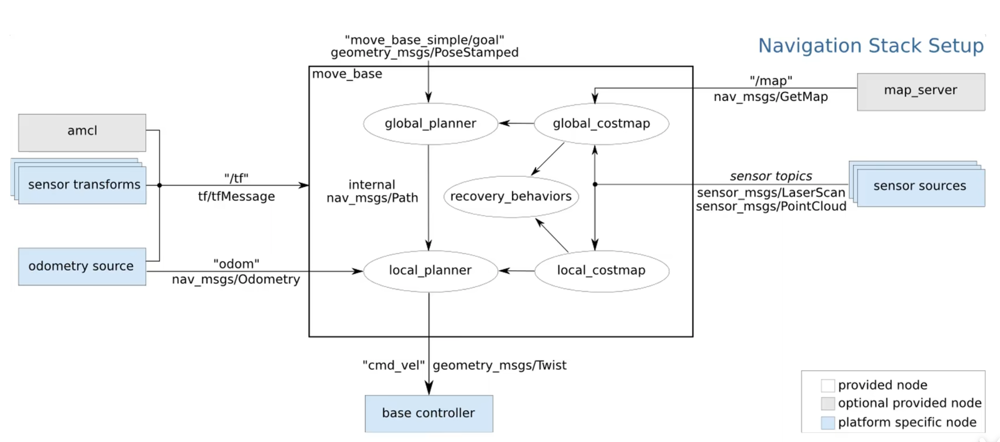
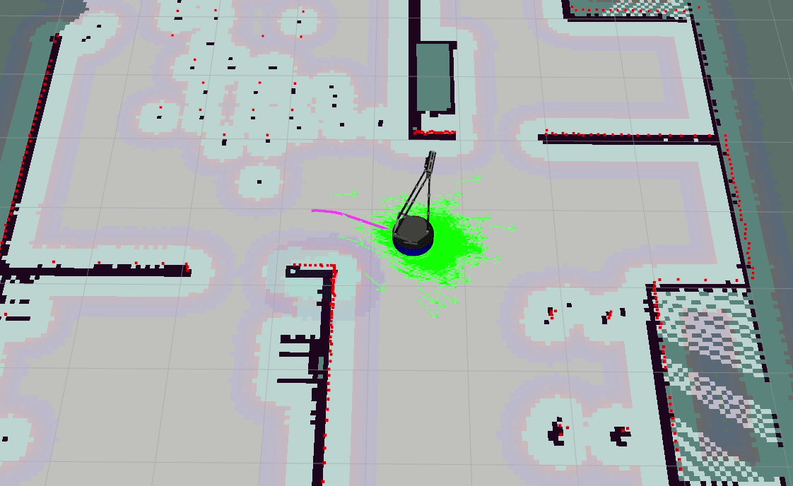
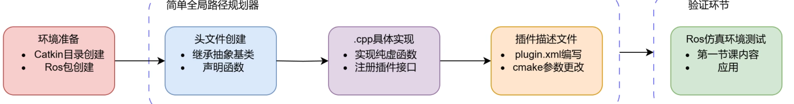
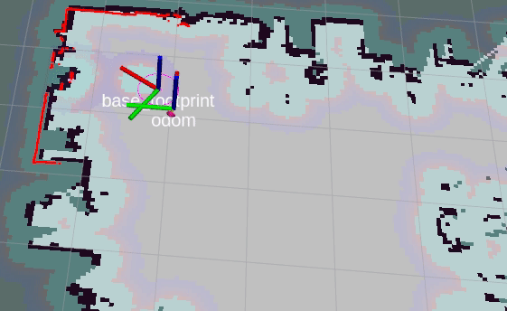
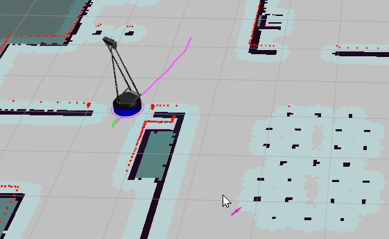

# ubuntu安装


问题：安装ubuntu20.04 ,用U盘制作系统盘进行双系统安装,但是会在安装界面卡死。

解决方法：拆下电脑固态硬盘，安装在NUC上进行安装，安装完之后再重新装回笔记本电脑，在启动项选择对应固态硬盘进行启动。

# P3X Robot


## 底盘控制

参考P3_使用说明,但是其键盘控制无法发送cmd_vel话题数据，可以使用rqt自带界面控制

```bash
rosrun rqt_robot_steering rqt_robot_steering 
```

## 建图

使用gmapping建图出现错误，使用hector建图可以使用，主要问题出现在tf树中odom和base_link断连。

翻阅源码后发现是rosaria软件包下的RosAria.cpp源文件中第626行坐标转换播报代码被注释了。

```cpp
odom_broadcaster.sendTransform(odom_trans);
```

取消注释即可正常建图。

# Move_base



1. provided node : amcl and map_server
1. send goal(rviz)

example:



## global_planner

- Dijkstra
- [A*](https://www.redblobgames.com/pathfinding/a-star/introduction.html) 

``` xml
<param name="base_global_planner" value="global_planner/GlobalPlanner" /> 
```

### my_global_planner



问题：

- 无法显示路径

通过添加路径topic在导航末尾发布数据

```cpp
plan_pub_ = nh.advertise<nav_msgs::Path>("/move_base/GlobalPlanner/plan", 1);
bool ok = aStarSearch(start, goal, plan);
if (!ok) {

    plan.clear();
    return false;
}else
{
        nav_msgs::Path gui_path;
        gui_path.header.stamp = ros::Time::now();
        gui_path.header.frame_id = start.header.frame_id; // 一般是 "map"
        gui_path.poses = plan;

        plan_pub_.publish(gui_path);
}
```

- 没有按照指定方向

  ```cpp
  plan.back().pose.orientation = goal.pose.orientation;
  ```

ex:


## AMCL(Adaptive Monte Carlo Localization)

自适应蒙特卡洛定位,采用粒子滤波器来跟踪已经知道的地图中机器人位姿

- 贝叶斯滤波,通过以前所有的控制和状态,预测现在的观测后的状态

Algorithm BayesFilter$(bel(x_{t-1}),u_t,z_t)$:
for all $x_t$ do
$$
\begin{align*}
\overline{\text{bel}}(x_t) &= \int p(x_t \mid u_t, x_{t-1}) \, \text{bel}(x_{t-1}) \, dx_{t-1} \\
\text{bel}(x_t) &= \eta \, p(z_t \mid x_t) \, \overline{\text{bel}}(x_t)
\end{align*}
$$

return bel($x_t$)

## local planner

自定义局部规划器插件

ex:



**问题:**

1. 若存在建图之外的未知物体,无法及时进行避障.

### DWA(Dynamic Window Approach)

原文论文：https://ieeexplore.ieee.org/document/580977

**评价函数:**
$$
G(v,w) =  \sigma \Big( \alpha \cdot \text{heading}(v, \omega) + \beta \cdot \text{dist}(v, \omega) + \gamma \cdot \text{vel}(v, \omega) \Big)
$$

- 目标朝向
- 障碍物距离
- 速度

**轨迹预测:**

近似后的速度函数:

$$
x\left(t_{n}\right)=x\left(t_{0}\right)+\sum_{i=0}^{n-1} F_{x}^{i}\left(t_{i+1}\right)
$$

$$
F_{x}^{i}\left(t_{i}\right)=\left\{\begin{array}{l}{{\frac{v_{i}}{w_{i}}\left(\sin\theta\left(t_{i}\right)-\sin\left(\theta\left(t_{i}\right)+w_{i}\cdot\left(t-t_{i}\right)\right)\right),w_{i}\neq 0}}\\{{v_{i}\cos\left(\theta\left(t_{i}\right)\right)\cdot t,w_{i}=0}}\end{array}\right.
$$

y同理:

$$
y\left(t_{n}\right)=y\left(t_{0}\right)+\sum_{i=0}^{n-1} F_{y}^{i}\left(t_{i+1}\right)
$$

$$
F_{y}^{i}\left(t_{i}\right)=\left\{\begin{array}{l}{{-\frac{v_{i}}{w_{i}}\left(\cos\theta\left(t_{i}\right)-\cos\left(\theta\left(t_{i}\right)+w_{i}\cdot\left(t-t_{i}\right)\right)\right),w_{i}\neq 0}}\\{{v_{i}\sin\left(\theta\left(t_{i}\right)\right)\cdot t,w_{i}=0}}\end{array}\right.
$$

$\cdot$ 当$w_{i}=0$时，机器人行走轨迹为一条直线

$\cdot$ 当$w_{i}\neq 0$时，机器人轨迹为圆弧，设：

$$
M_{x}^{i}=-\frac{v_{i}}{w_{i}}\cdot\sin\theta\left(t_{i}\right) 
$$

$$
M_{y}^{i}=\frac{v_{i}}{w_{i}}\cdot\cos\theta(t_{i})
$$

化简可得:

$$
\left(F_{x}^{i}-M_{x}^{i}\right)^{2}+\left(F_{y}^{i}-M_{y}^{i}\right)^{2}=\left(\frac{v_{i}}{w_{i}}\right)^{2}
$$
**安全速度:**
$$
V_a = \left\{ (v, w) \ \middle|\ v \leq \sqrt{2 \cdot \text{dist}(v, w) \cdot \dot{v}_b} \ \cap \ w \leq \sqrt{2 \cdot \text{dist}(v, w) \cdot \dot{w}_b} \right\}
$$
**动态窗口速度:**
$$
V_d = \left\{ (v, w) \ \middle|\ v \in [v_a - \dot{v} \cdot t,\ v_a + \dot{v} \cdot t] \ \cap \ w \in [w_a - \dot{w} \cdot t,\ w_a + \dot{w} \cdot t] \right\} \\
$$
最终搜索空间:
$$
V_r = V_s \cap V_a \cap V_d
$$
ex:

